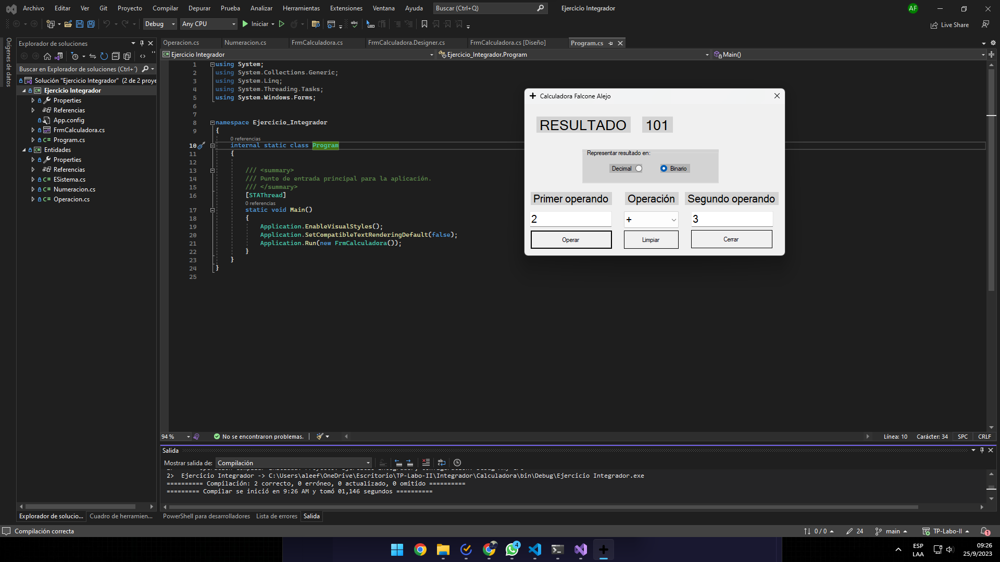

## TP LABO  Y PROGRA 2 ➕

El TP se basaba en crear una calculadora con una interfaz gráfica que pueda realizar las operaciones básicas y ademas transformar los numeros de decimal a binario según lo decida el usuario. Les dejo la [Consigna](consigna.pdf)

Me tomo bastante tiempo poder terminarlo, pero al final creo que quedo bastante prolijo y ordenado. Me sirvió para entender muchas cosas sobre PP.OO, organización de código y C# en general.

---

### PREVIEW 👀

---
>Espero les guste❗️

